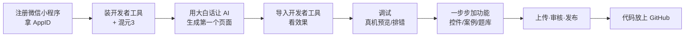

# 写在前面：不懂代码也能做

> 先说一句大实话：**这本教程里所有的小程序代码，都是 AI 写的，我一个字都没手敲。**
> 我做的只是——把想法用大白话告诉 AI，然后在微信开发者工具里把它跑起来、调好、发出去。

如果你也和我一样，**不懂编程、看代码就头大**，那这套教程就是为你写的。

---

## 一、你将拥有什么？

跟着做完，你会得到一个真实可用、能扫码打开的微信小程序，名字叫「**微信小程序教程**」。它里面包含：

| 模块 | 内容 | 你能用它干嘛 |
|------|------|--------------|
| 交互控件 | 42 个控件的点击演示 | 看看按钮、表单、弹窗长啥样、怎么用 |
| 实战案例 | 8 个完整页面（登录、商品列表、聊天…） | 学别人怎么做常见页面 |
| 测试题库 | 138 道题的答题系统 | 边学边测，巩固记忆 |
| 硬件能力 | 24 项设备能力（扫码、定位、振动…） | 在真机上体验手机能调用的能力 |

重点是：**这整套东西，不需要你写一行代码。**

---

## 二、你只需要准备三样东西

1. 💻 **一台电脑**（Windows 或 Mac 都行）
2. 📱 **一个微信账号**（用来注册和扫码）
3. ⌨️ **会打字**（能用中文把你的想法描述出来）

不需要数学好、不需要英语好、不需要以前学过编程。

---

## 三、什么是「vibe coding」？

传统做法是：人写代码 → 电脑运行。
**vibe coding（氛围编程）** 是：人讲需求 → AI 写代码 → 人验收和调。

打个比方，传统开发像「你自己动手做饭」；vibe coding 像「你当老板，把想吃的菜告诉厨师，厨师做出来你尝一口，不对就让他改」。

本教程里，你的「厨师」是 **混元3**（腾讯的 AI 大模型）。你只要在对话框里用中文告诉它想要什么，它就帮你把小程序的代码写出来。

---

## 四、整体路线图

每一章，我们都按这个节奏走：

> **你说的话 → AI 做的事 → 你在工具里看到的结果 → 出问题怎么让 AI 修**

---

## 五、怎么用这本教程？

- 建议**从头到尾顺读**，因为后面的章节依赖前面的环境。
- 看到 `![待补]` 字样的图片，是让你在微信开发者工具里**照着截图操作**的位置，图我们会一步步配。
- 每一章结尾都有「你可以让 AI 怎么说」的**可直接复制的提示词**，复制粘贴就能用。

准备好了吗？下一章，我们先去拿到小程序的「通行证」——AppID。

> ➡️ [第 1 章 · 拿到通行证 AppID](docs/01-account.md)
