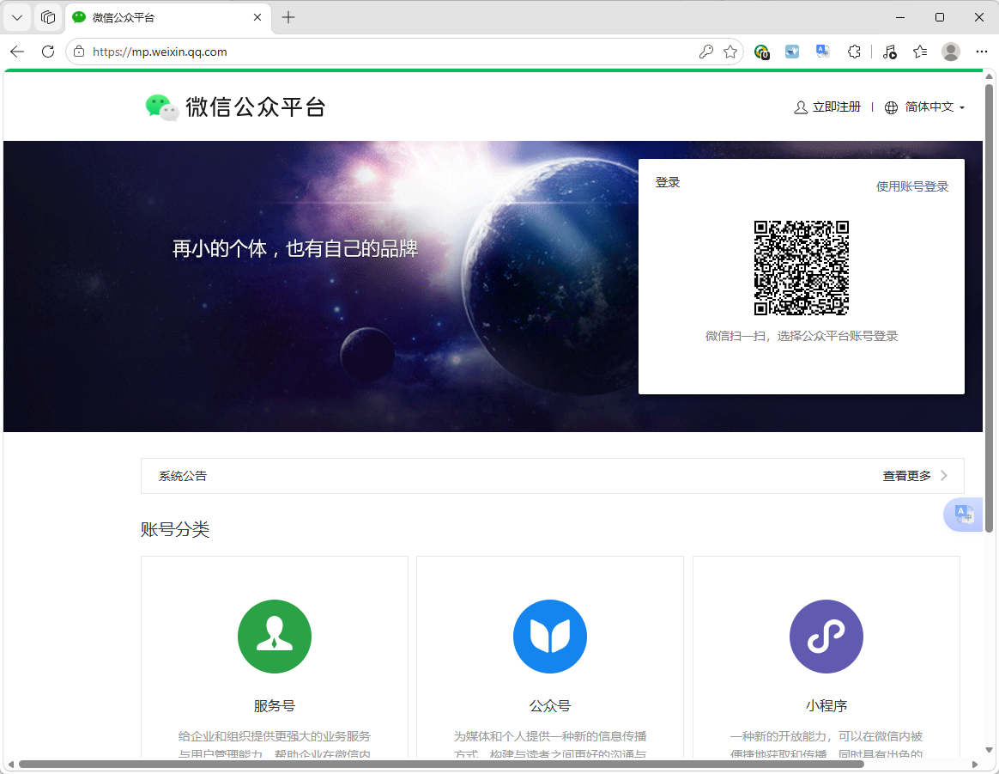
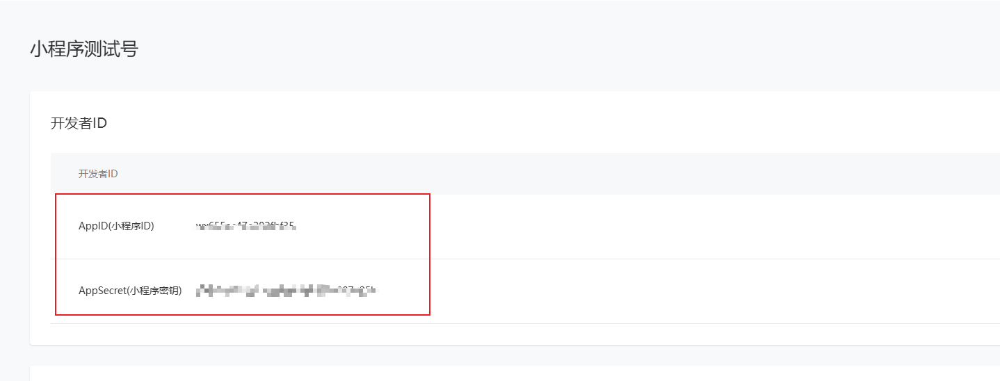
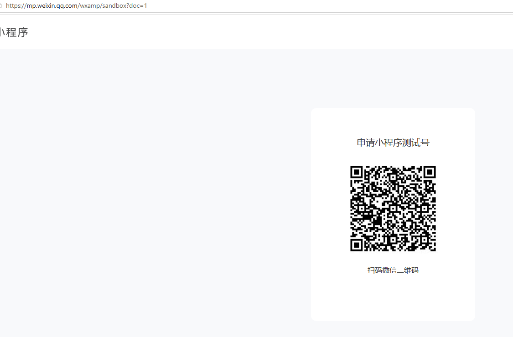

# 第 1 章 · 拿到通行证 AppID

每个微信小程序都有一个唯一的身份证号，叫 **AppID**。有了它，你才能在「微信开发者工具」里把项目跑起来、才能在手机上预览。

本章你会知道：AppID 在哪拿，以及——**小白最省事的办法：先用「测试号」，零门槛，不用注册也能开发。**

---

## 1.1 打开注册页面

用电脑浏览器打开微信公众平台：

> 🔗 <https://mp.weixin.qq.com>

右上角点「**立即注册**」，账号类型选「**小程序**」。

如果用「正式小程序」：按页面提示填邮箱、设密码、去邮箱激活、再填主体信息（个人选「个人」即可）。整个过程 5~10 分钟。

---

## 1.2 找到你的 AppID

注册并登录后，进「**开发管理 → 开发设置**」，就能看到 **AppID（小程序 ID）**。

💡 这张截图里同时能看到 **AppSecret（小程序密钥）** 的位置。它在你当前页面的 **AppID 下方**，点「生成」就能显示。记住：**密钥不要发给任何人、不要截图外传**。

⚠️ AppID 虽然可以公开，但 **AppSecret 是最高机密**。一旦泄露，别人能用你的身份乱发东西。本教程全程用「测试号」，根本不需要 AppSecret，最安全。

---

## 1.3 小白推荐：直接用「测试号」

如果你只是想**先跑通流程、学怎么开发**，根本不用注册正式小程序。微信开发者工具自带「**测试号**」模式：

- 不需要注册、不需要邮箱、不需要主体信息
- 打开工具就能用，AppID 自动填好（形如 `touristappid`）
- 唯一限制：部分能力（如微信登录、支付）在测试号下不可用；但**本教程的控件、案例、题库、硬件演示都能玩**

✅ **本教程通篇使用测试号**，你照着做完全够用。等你真要做正式上线的小程序，再回看 1.1~1.2 注册一个正式 AppID，替换掉测试号即可（详见[第 9 章](docs/09-replace.md)）。

---

## 1.4 本章小结 & 下一步

- ✅ 知道了 AppID 是啥、在哪看
- ✅ 决定用「测试号」零门槛开发（最省事、最安全）
- 📌 记住：正式上线才需要注册 + AppSecret

下一章，我们装两个工具：微信开发者工具（用来跑小程序）+ 混元3（你的 AI 厨师）。

> ➡️ [第 2 章 · 装两个工具就够了](docs/02-tools.md)
