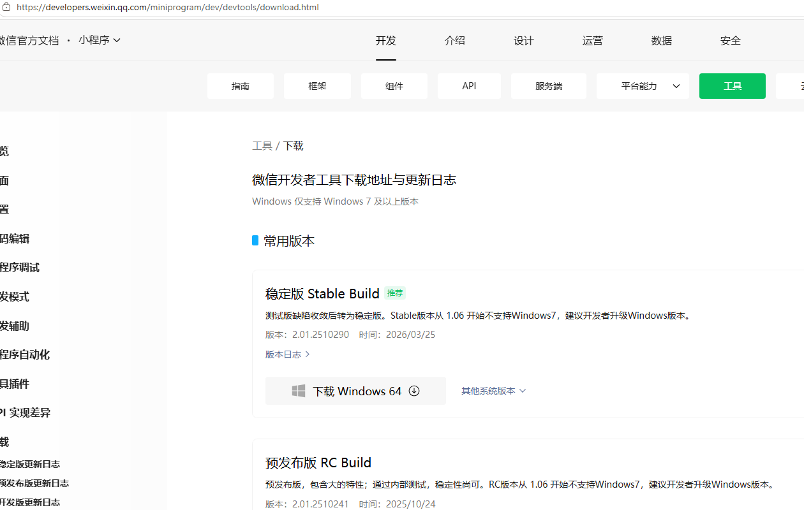
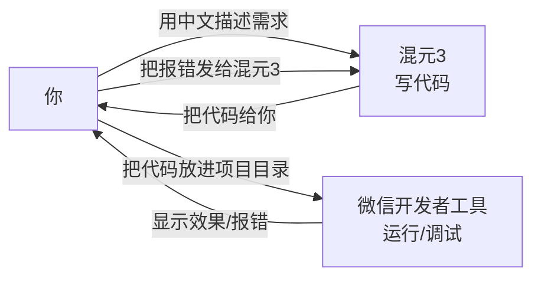

# 第 2 章 · 装两个工具就够了

做小程序，你电脑上只需要两个东西：

1. **微信开发者工具** —— 小程序的「运行舞台」，代码在这里跑起来、在这里调试、在这里发布。
2. **混元3** —— 你的 AI 搭档，负责把你的话变成代码。

---

## 2.1 安装微信开发者工具

打开官网下载页：

> 🔗 <https://developers.weixin.qq.com/miniprogram/dev/devtools/download.html>

按你的系统（Windows / macOS）选**稳定版（Stable）**下载安装。

装好后打开，会提示你用微信**扫码登录**，按提示扫一下即可。

装完先别急着建项目，下一步我们让 AI 把代码备好，再「导入」进来。如果你手痒想点「+ 创建小程序」，也可以，但我们后面会直接用 AI 生成的项目，所以先放着。

---

## 2.2 你的 AI 搭档：混元3

混元3 是腾讯出品的 AI 大模型。你只要用**中文**把想要的小程序描述给它，它就会写出代码。

你可以用以下任一入口（选你方便的）：

- 腾讯混元官网网页版（对话界面）
- 混元 APP
- 任何你常用的、能访问混元的渠道

📷 **图待补**：混元3 的对话界面截图。你现在只要知道：打开混元3 后，直接在输入框里用中文打字描述需求即可。

💡 关键认知：**你不需要懂代码，但你要学会「把需求讲清楚」**。讲得越具体，AI 写得越准。后面每一章我都会给你**可直接复制的提示词**，你照着发就行。

---

## 2.3 两个工具怎么配合？

一句话：**混元3 负责写，开发者工具负责跑，你负责看效果、传话、验收。**

---

## 2.4 本章小结 & 下一步

- ✅ 装好微信开发者工具并扫码登录
- ✅ 准备好混元3 这个 AI 搭档
- ✅ 理解了「AI 写、工具跑、你验收」的协作关系

下一章，重头戏来了：用一句话，让 AI 变出你的第一个页面。

> ➡️ [第 3 章 · 一句话变出第一个页面](docs/03-first-vibe.md)
