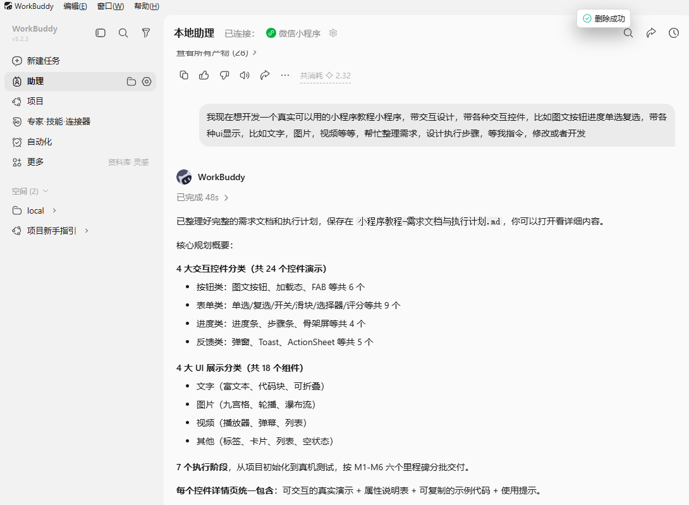

# 第 3 章 · 一句话变出第一个页面

这一章是 vibe coding 的第一次体验：**你只在对话框里打了几句中文，AI 就把一个能跑的小程序页面造出来了。**

---

## 3.1 怎么向 AI 描述需求

新手最容易犯的错误是：「帮我做个小程序」。这句话太模糊，AI 不知道从哪下手。

好需求 = **对象 + 功能 + 长相 + 风格**。给你一个万能模板：

```
我要做一个微信小程序，主题是「微信小程序教程」。
先做一个首页，要求：
1. 顶部一个搜索框
2. 下面一排分类卡片（按钮类、表单类、进度类、反馈类）
3. 底部有「最近浏览」列表
风格：简洁、微信绿为主色、卡片圆角
技术：原生微信小程序，不要框架
请把生成的文件列出来，并说明每个文件是干嘛的。
```

把上面这段直接发给混元3（或你正在使用的 AI 助手）。



---

## 3.2 AI 生成了哪些文件？（白话版）

AI 会吐出一堆文件。别慌，对小白来说，你只要知道它们是干嘛的：

| 文件 | 白话解释 | 你要管吗 |
|------|----------|----------|
| `.wxml` | 页面的**骨架/结构**（哪里放按钮、哪里放文字） | 不用管，AI 写 |
| `.wxss` | 页面的**化妆/样式**（颜色、大小、间距） | 不用管，AI 写 |
| `.js` | 页面的**大脑/逻辑**（点了按钮发生啥） | 不用管，AI 写 |
| `.json` | 页面的**配置**（标题、用不用某个组件） | 不用管，AI 写 |

> 你不需要看懂它们，只要会**问 AI「这个文件是干嘛的」**，AI 会用大白话解释给你听。

AI 开始生成时，会先给你一个整体方案，然后逐一把文件写出来。下面是你在对话框里可能看到的结构：

<div class="note">

📷 **图待补**：AI 正在生成代码的对话截图。你现在只要知道它会返回代码片段 + 文件清单即可。

</div>

---

## 3.3 项目目录长什么样

AI 给你的代码，最终会放进一个文件夹里。一个最基础的小程序目录长这样：

```
miniprogram-tutorial/
├── app.js          # 小程序总开关
├── app.json        # 全局配置（页面清单、窗口样式）
├── app.wxss        # 全局样式
├── pages/
│   └── index/      # 首页
│       ├── index.wxml
│       ├── index.wxss
│       ├── index.js
│       └── index.json
└── project.config.json  # 开发者工具的项目配置
```

用文件管理器打开，你能看到和上面类似的树状结构。下一章导入项目后，你会在开发者工具的左侧文件树里亲眼看到这些文件。

<div class="note">

📌 本教程配套代码就长这样，而且**已经帮你做好整套**了。你不用从零让 AI 写全部，只要理解「AI 是怎么一步步把这一堆文件凑齐的」就行。想看 AI 生成的具体内容，导入项目后随便点开一个文件，比如 `data/controls.js`，就能看到中文注释和代码。

</div>

---

## 3.4 本章小结 & 下一步

- ✅ 学会了「好需求 = 对象+功能+长相+风格」的描述公式
- ✅ 知道了 `.wxml/.wxss/.js/.json` 四个文件分别是干嘛的（不用懂，知道就行）
- ✅ 看到了项目目录长什么样

光有一堆文件还不够——下一章，我们要把它们「导入」微信开发者工具，亲眼看到首页跑起来。

> ➡️ [第 4 章 · 导入项目，看见效果](docs/04-import.md)
