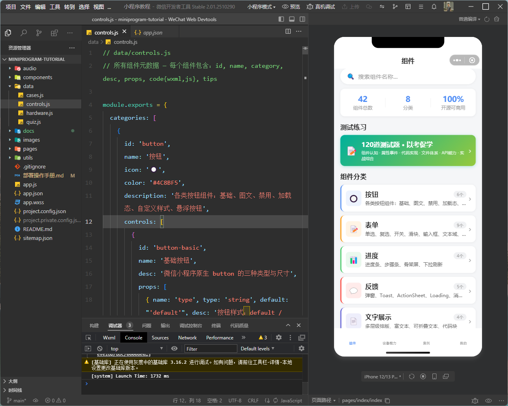

# 第 4 章 · 导入项目，看见效果

代码在文件夹里是「死的」，放进微信开发者工具才会「活」起来。本章你第一次亲眼看到自己的小程序跑起来。

---

## 4.1 导入项目

打开微信开发者工具，如果你用的是测试号，直接选「**+**」或「导入项目」：

1. **项目目录**：点「选择」，选中你的 `miniprogram-tutorial` 文件夹
2. **AppID**：选「**测试号**」即可（不用填真实 AppID）
3. **项目名称**：填 `微信小程序教程`
4. 点「导入」

<div class="note">

📷 **图待补**：导入项目对话框。操作：点「导入项目」→ 选择 `miniprogram-tutorial` 文件夹 → AppID 选「测试号」→ 项目名填「微信小程序教程」→ 点导入。

</div>

<div class="warn">

⚠️ **项目目录一定要选到最里层、包含 `app.json` 的那个文件夹**。如果选错了上层目录，工具会提示「不是小程序项目」。

</div>

---

## 4.2 认识三大区

导入成功后，你会看到工具主界面，分三块：

```
┌─────────────┬──────────────────┬─────────────┐
│  模拟器       │   编辑器（代码）   │  调试器       │
│ （手机预览）  │  （AI 写的代码）  │ （看报错）   │
└─────────────┴──────────────────┴─────────────┘
```

- **模拟器**（左）：一台「虚拟手机」，你的小程序长这样、能点。
- **编辑器**（中）：代码长什么样，一般你**不用改**，看完知道 AI 写了啥就行。
- **调试器**（右）：出问题时看报错的地方（第 5 章重点用）。



---

## 4.3 第一次看到首页

导入完，模拟器里应该直接显示出小程序首页——有搜索框、分类卡片（见上图右侧模拟器）。

<div class="tip">

🎉 恭喜！你没写一行代码，但一个真实的小程序已经在你电脑上跑起来了。这就是 vibe coding 的魔力。

如果首页是**白屏/报错**，别慌，翻到第 5 章，我们专门讲怎么让 AI 把问题修好。

</div>

---

## 4.4 本章小结 & 下一步

- ✅ 学会了把代码「导入」开发者工具（选目录 + 测试号）
- ✅ 认识了模拟器 / 编辑器 / 调试器三大区
- ✅ 亲眼看到首页跑起来 🎉

下一章是**全教程最值钱的一章**：调试全流程。学会它，你就从「能跑」变成「跑得稳、能真机用」。

> ➡️ [第 5 章 · 调试全流程（高光）](docs/05-debug.md)
