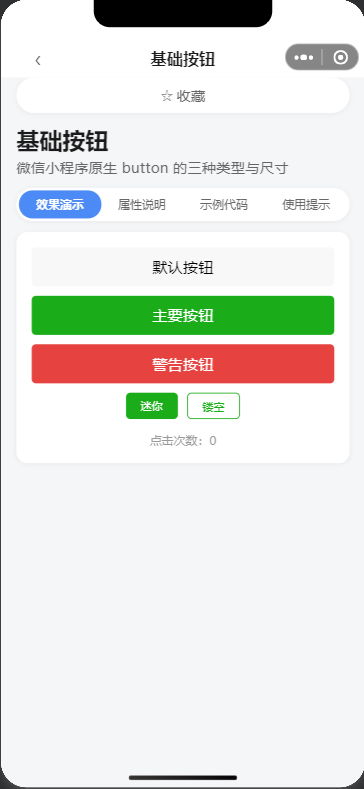
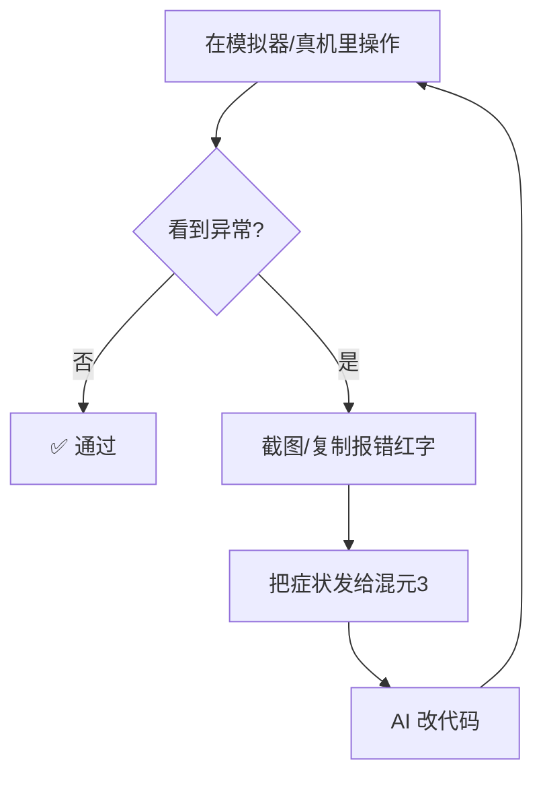

# 第 5 章 · 调试全流程（高光）

> 会写代码不算本事，**会调代码才是**。而 vibe coding 里，调试的本质是：**把「看到的异常」原样告诉 AI，让它改。**

这一章带你走完最常见的三种调试场景。

---

## 5.1 在模拟器里点一点

先在模拟器里当回用户，把每个按钮、每个页面都点一遍，看看交互对不对。



发现不对劲（点了没反应、样式错位、文字乱码）时，记下**具体哪个页面、哪个操作**，这就是你待会要告诉 AI 的「症状」。

---

## 5.2 看懂 Console（报错都在这）

点开右侧「**调试器 → Console**」标签。小程序运行时的报错、日志都在这里。

正常情况是一片干净，或只有些提示。

<div class="note">

📷 **图待补**：Console 面板截图。打开方式：右侧「调试器 → Console」。如果没有红色字，说明当前页面没有报错。

</div>

如果出现**红色字**，那就是报错了。红字里最关键的是第一行：**错误类型 + 发生在哪个文件哪一行**。

<div class="note">

你不用读懂报错。你只要**截图红字**，然后发给混元3 说：「我的小程序报这个错，帮我修」，AI 就会定位并改好。

</div>

---

## 5.3 真机调试：手机扫码看真实效果

模拟器只是「差不多」，真机才是「真的」。点工具栏「**真机调试**」，会弹出一个二维码，用真机微信扫码即可。

<div class="note">

📷 **图待补**：真机调试二维码截图。这个二维码有效时间有限，扫完就能在手机上看到和真用户完全一致的效果。

</div>

<div class="note">

📷 **图待补**：手机上运行的小程序实拍。建议用另一台手机拍一张，用于教程和自我介绍。

</div>

<div class="tip">

📱 真机调试能发现模拟器发现不了的问题（比如摄像头、定位、振动这些硬件能力，只能在真机试）。本教程的「硬件能力」模块就强烈建议真机调试。

</div>

---

## 5.4 翻车现场①：请求接口报域名错

这是新手最高频的报错之一。当你让 AI 做了「联网获取数据」的功能，真机/模拟器可能报类似：

```
url not in domain list / 不在以下 request 合法域名列表中
```

原因是：微信要求小程序的网络请求必须走**备案过的 HTTPS 域名**，测试号默认没配。

**你这样告诉 AI：**

> 我在真机调试时，wx.request 报「url not in domain list」。我是测试号，先不用真实域名。请帮我把请求改成模拟数据（本地写死返回），让页面能正常显示，正式上线时再换真接口。

AI 改完后，重新编译预览，页面就会正常显示。调试循环也就此完成。

<div class="warn">

⚠️ 正式上线要配「request 合法域名」（在公众平台「开发设置 → 服务器域名」里加）。测试阶段用模拟数据是最高效的绕过方式。

</div>

---

## 5.5 翻车现场②：测试号功能受限

有些能力（微信登录、支付、部分接口）测试号不支持，真机调试会提示「该功能测试号不可用」。

**你这样告诉 AI：**

> 这个功能我现在用测试号跑不了，先做个「未授权/不可用」的友好提示占位，等我用正式 AppID 再接真实逻辑。

AI 会给一个优雅的兜底提示，而不是白屏崩溃。

---

## 5.6 调试循环总结



一句话口诀：**看到怪 → 拍下来 → 丢给 AI → 再看一遍**。

---

## 5.7 本章小结 & 下一步

- ✅ 会用模拟器点检交互
- ✅ 会在 Console 找报错红字（不用懂，会截图就行）
- ✅ 会真机调试扫码
- ✅ 掌握「报错 → 描述 → AI 修 → 复验」的循环

下一章，我们看看怎么让小程序「长大」：一步步加控件、案例、题库、硬件能力。

> ➡️ [第 6 章 · 让小程序长大](docs/06-grow.md)
