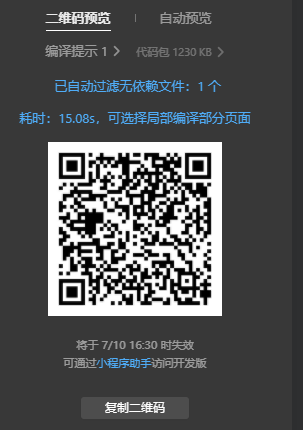

# 第 7 章 · 预览 · 上传 · 发布

代码在电脑上跑通了，现在让它变成「别人微信里能搜到、能打开」的真正小程序。

> ⚠️ 注意：本章的「上传 / 审核 / 发布」需要**正式 AppID**（测试号不能发布）。如果你还在用测试号，可以先做「预览」看效果，发布那步等注册正式号后再来（见[第 9 章](09-replace.md)）。

---

## 7.1 预览：生成二维码自己先看

在开发者工具点「**预览**」，会弹出一个二维码：

用真机微信扫它，手机上就能打开你当前版本的小程序。这是发布前最后的自检。

---

## 7.2 上传代码：交给微信后台

确认没问题后，点「**上传**」。会让你填：

- **版本号**：如 `1.0.0`
- **项目备注**：如「初版：控件教程 + 案例 + 题库」

📷 **图待补**：上传代码对话框。填写版本号（如 `1.0.0`）和项目备注，点确认后代码进入微信后台。

点确认，代码就传到微信后台，变成一个「开发版本」。

---

## 7.3 提交审核 → 发布

登录公众平台 <https://mp.weixin.qq.com> → 「**版本管理**」，你会看到刚上传的「开发版本」：

📷 **图待补**：公众平台「版本管理」页面，能看到刚上传的「开发版本」。

点「**提交审核**」，按要求填信息（类目、功能页面截图等）。微信一般 1~3 天审完。审核通过后，在「版本管理」点「**发布**」，你的小程序就正式上线了！

📷 **图待补**：提交审核 / 发布按钮位置。

🚀 发布成功后，别人在微信里搜你的小程序名就能找到它。那一刻，你就成了「做过小程序的人」。

---

## 7.4 本章小结 & 下一步

- ✅ 预览：扫码自检
- ✅ 上传：填版本号交给后台
- ✅ 审核 + 发布：上线！（需正式 AppID）

代码上线了，但你的「作品」还应该有个家——下一章，把代码放上 GitHub，既能备份、又能开源分享给别人。

> ➡️ [第 8 章 · 把代码放上 GitHub](08-github.md)
